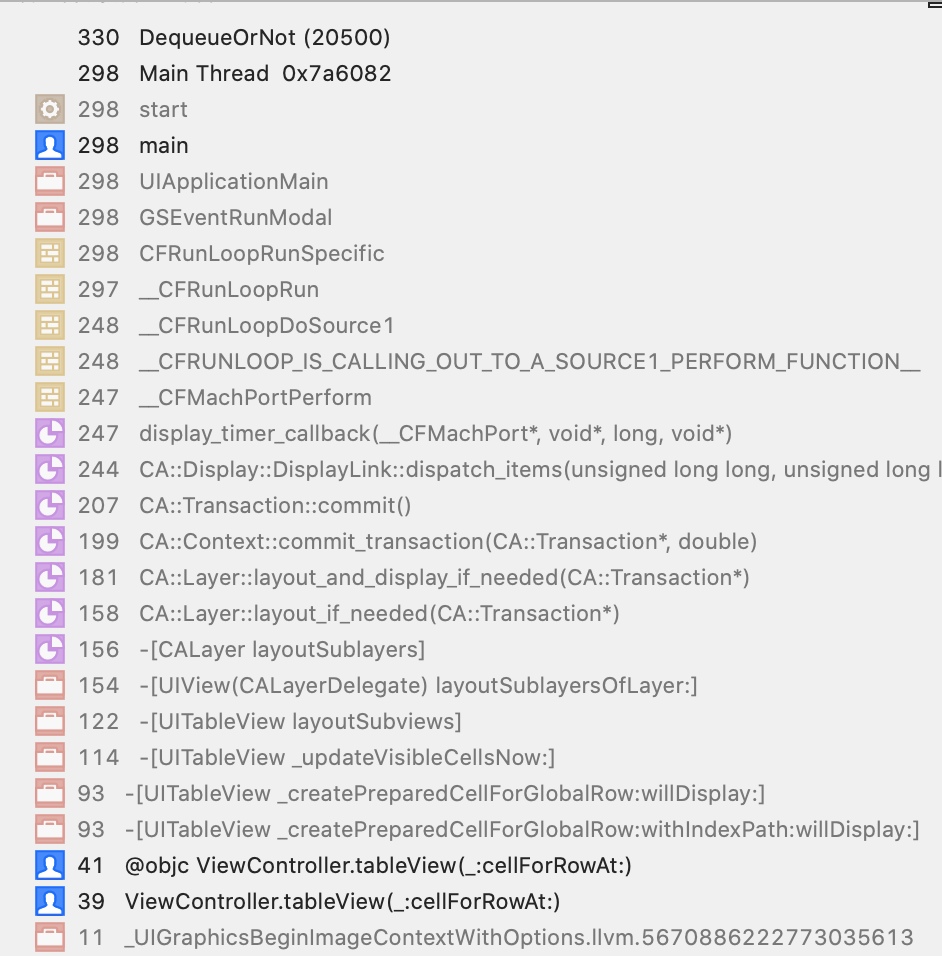
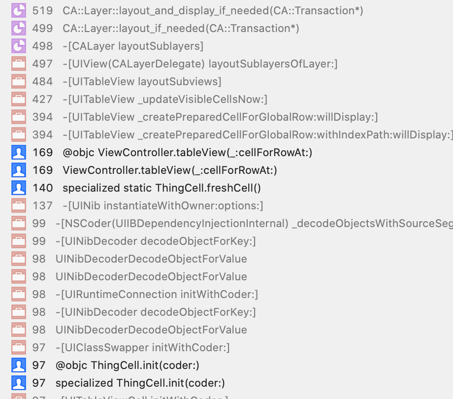

# DequeueOrNot

Investigation into what dequeuing tableview cells does in a modern iOS environment. 

Inspired by a conversation in the comments of [this SO question](https://stackoverflow.com/questions/56525434/list-view-really-slow-and-laggy?noredirect=1#comment99991829_56525434) about lagginess in SwiftUI Lists I constructed a test harness to figure out what the effects of dequeing cells in a UITableView are.

## Requires

At least Xcode 11 Beta 2 or better. Catalina Beta 2 and some iOS 13 hardware might be useful too. 

## Introduction

I made a lazy comment in SO comment about dequeing cells not being neccessary from a *memory* perspective any longer as the underlying hardware no longer needs such aggressive memory management. One of the other posters quite correctly pulled me up on that statement and asked for sources. I don't remember and so I thought id figure out if dequeing is needed or not still.

## Test Harness 

The app is a basic Tab Controller with two view controllers. 

1. A `UIViewController` with a `UITableView` that can be either used in a **standard** dequeued mode or instantianting fresh cells for each row. 

2. A `SwiftUI` based list with roughly the same layout as the `UIViewController` based version.

The ``UIKit` cell was a custom XIB with two labels and a small image to ensure that this was not a trivial test of stock `UITableViewCell` instances called `ThingRow`

The dataset was a simple array of 500 `struct` items called `Thing` 

## Results 

Using UIKit, the dequeued UIViewController had the best **frame rate** performance. 

### Dequeued 

**Hardware (iPad Air 2 )**

- Max = 2695 cell/s
- Min = 568 cell/s

**Simulator** 

- Max = 4310 cell/s
- Min = 314 cell/s

### Non-Dequeued

**Hardware (iPad Air 2 )**

- Max = 428 cell/s
- Min = 93 cell/s

**Simulator**

- Max = 795 cell/s
- Min = 102 cell/s

**Memory** footprint was about even with Dequeued mode being about 1.0 MB less than Non-Dequeued. The non-dequeued cells can be observed releasing using Console logging. 

- Non-Dequeued = circa 25MB 
- Dequeued = circa 24MB

SwiftUI had the worst subjective performance with choppy scrolling  but with no direct way to get the frame rate I resorted to using `Instruments` to measure the time profile. 

## Why is SwiftUI so choppy

The stack traces for the UIKit version is fairly self explanatory. 

Dequeued spends most time in the cell rendering phrase.

Non-dequeued needs to that stuff AND dearchive a cell. 

SwiftUI is a black box but two things stood out:

- Automatic text localisation seemed to be a heavy part of the render phase 
- The entire system is doing a fuckton of work with super deep traces

## Conclusions 

For a `UITableView` based list *should* you use cell recycling? Yes, you'll get the best frame rate for your table and make your customers happy.

But you don't *need* to do it to keep your app from dying a memory death ( ARC is magic! ) and the frame rate was acceptable just not quite as smooth as the dequeued version. If you have a use case where you can't dequeue, it isn't going to be a deal breaker. 

`SwiftUI` is a beta framework and will get better at doing lists so performance is probably not worth worrying about. Rest assured though it's probably not your code (maybe). 

